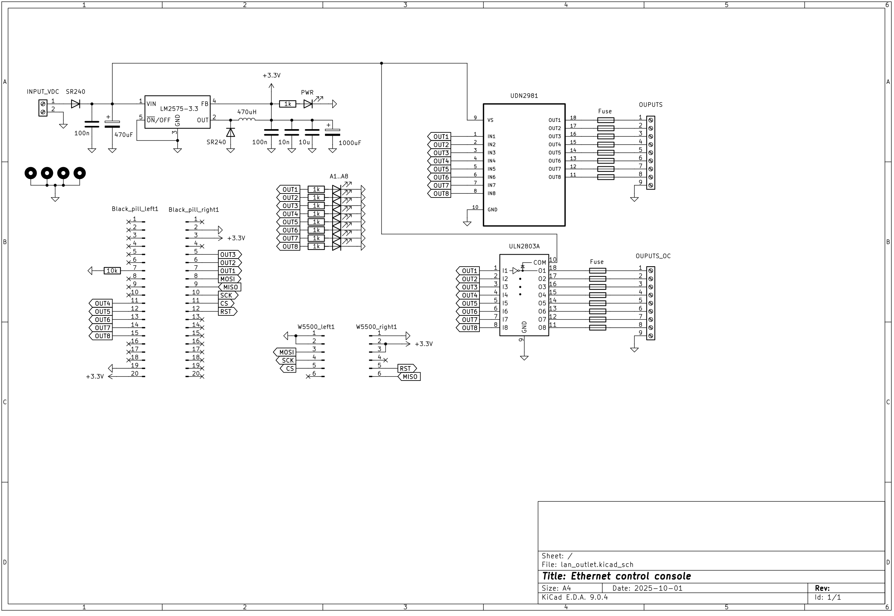
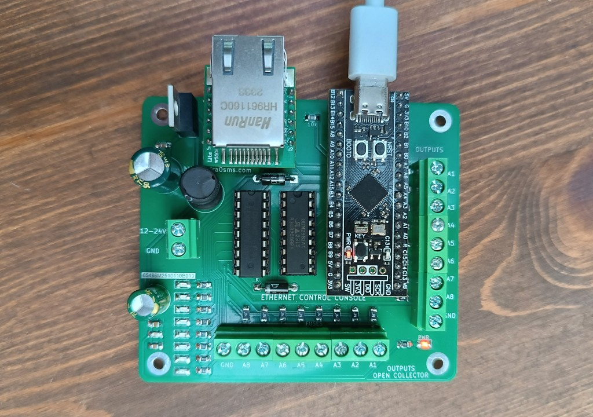
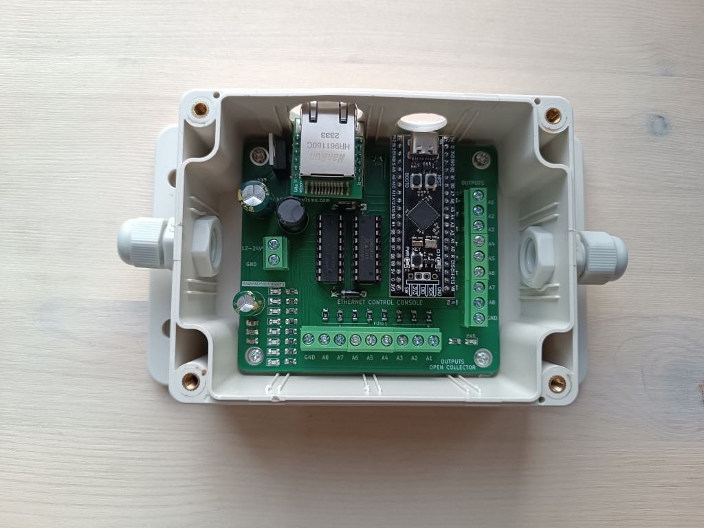
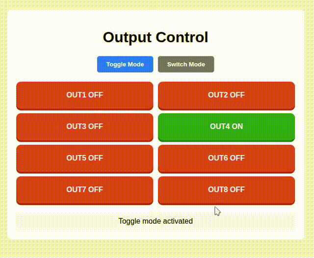
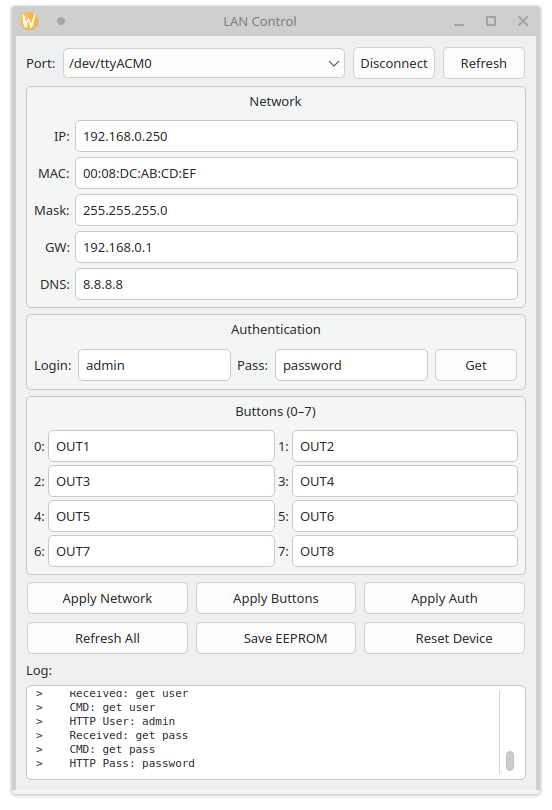

### Ethernet control console

The device allows you to control 8 outputs via an Ethernet connection. The main outputs control voltage and are also duplicated by open-collector outputs.

Input VDC: 5-45 V

Output current: 500 mA for all 8 outputs (also 500 mA for all open-collector outputs)

PCB dimension: 78*88 mm

[WI-FI version with the same functionality](https://github.com/ra0sms/ESP8266_antenna_switch)

More information - https://ra0sms.com/ethernet-control-console

#### Schematic

#### PCB

#### Boxed version

#### Web interface

#### Configuration software

